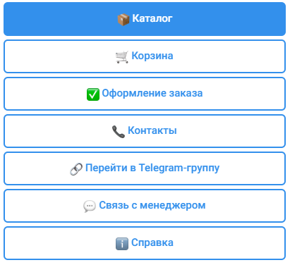
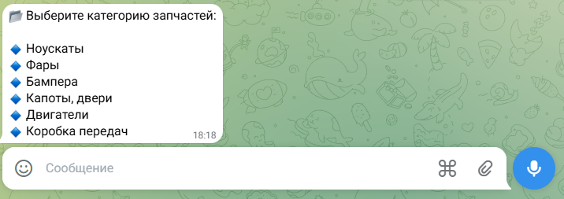
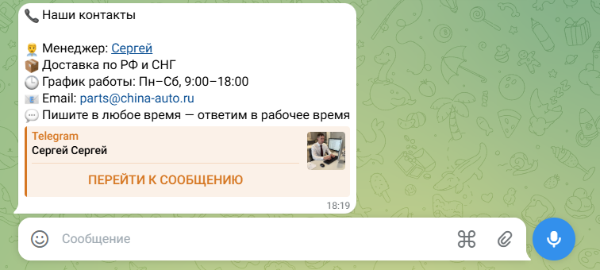

# 🚗 Telegram-бот для заказа автозапчастей из Китая

Бот помогает клиентам подбирать и заказывать автозапчасти с доставкой из Китая.  
Экономия до 40%, гарантия, быстрая доставка по РФ и СНГ.

🔧 Примеры запчастей: ноускаты, фары, бампера, двигатели, коробки передач и др.

🤖 Бот работает на базе **Telegram** и позволяет:
- Просматривать каталог
- Добавлять в корзину
- Оформлять заказ
- Связываться с менеджером

📩 Менеджер: [@PSergei007](https://t.me/PSergei007)

---

## 📸 Скриншоты

### Главное меню


> *Нажмите /start — бот приветствует и показывает кнопки*

### Каталог запчастей


> *Выбор по категориям: фары, бампера, двигатели и др.*

### Связь с менеджером


> *Прямая ссылка на менеджера — удобная коммуникация*

---

## ⚙️ Как запустить бота

1. **Клонируй репозиторий**
   ```bash
   git clone https://github.com/yourname/autospares-bot.git
   cd autospares-bot